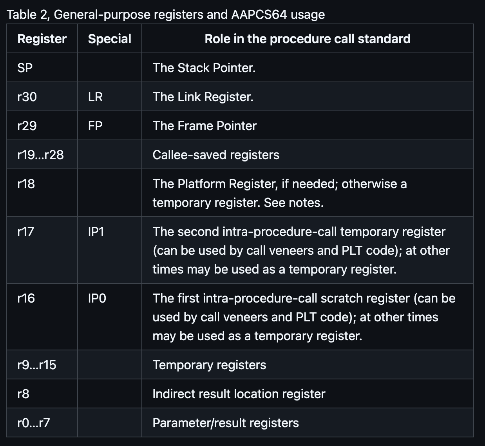

# jffの仕様
コミット時点でのコンパイラもとい言語の仕様(EBNF等)を記述していく
ただここの変更忘れが多いので、これが各コミット時の仕様に必ずしもなっていない点に注意。

## コンパイルできるもの
- 数字
- 加減算
- 四則演算(+, -, *, /, ())
- 比較演算子(==, !=, <, <=, >, >=)
- 一文字以上のローカル変数宣言
- return
- {}
- if
- for
- while
- 引数なし関数呼び出し
- 引数あり関数呼び出し(8個まで)
- intから始まる変数定義
  - "int" を使えているというか、intを無視しているという形になっているのは良くない点かもしれない。
  - int x, y; は未対応
- 関数定義(引数なし)
- 関数定義(引数あり)
- 単項*, 単項&
- intの初期化(まだintが8byteになっている点に注意)
- 1次元配列

## 演算の優先順位(低い順)
低
1. =
2. ==, !=
3. < <= > >=
4. +, -
5. *, /
6. 単項+, 単項-, 単項*, 単項&
7. ()

高

## 修正したい点
- コードが見づらくなってきた
- rustもアセンブリも冗長なコードが多い
- 構造体にまとめたい
- 今は全てが関数の中にないといけない
- pushのアセンブリやらが、読みづらい。から、デバッグしづらい
- intがあるけど、今は無視するだけになっている
- ポインタ演算まだ
- 型もない
- 0割り算を許容してしまっているんだった
- %演算子もサポートしたい
- tokens.removeで進めるのはどうなのか。
- 未定義変数への代入をエラーに(?)
- 出力アセンブリのインデントを良い感じに変数で設定したい
- panic!で処理しているところ、自分のエラー関数で処理したい(そんなに該当箇所ないかも。undefined variableくらい？)
- int x[5]; みたいな感じの変数宣言
- funccallの返り値をpointerに対応させる?


## EBNF
- function(definition) = declspec declarator ident "(" func_args? ")" compound-stmt
- declaration = declspec declarator var_assign ("," declspec declarator var_assign)* ";"
- declspec = "int"
- declarator = "*"*
- var_assign = ident ("," ident)? ("=" expr)?
- func_args = (var_def ("," declspec decralator var_def)*)
- var_def = declspec declarator ident ("[" num "]" )?
<!-- - type_suffix = "(" func-params | "[" num "]" | ε -->

- stmt = expr-stmt | "return" expr ";" | "{" compound-stmt | "if" "(" expr ")" stmt ("else" stmt)? | "for" "(" expr_stmt expr? ";" expr? ")" stmt | "while" "(" expr ")" stmt
- compound-stmt = (declaration | stmt)* "}" // "{" があるかどうかでexpr-stmtと区別している
- expr_stmt = expr? ";" 
  - この時のexprが、未定義だったらエラーにする、というふうにすれば未定義の変数代入をエラーにできる？
- expr = assign
- assign = equality ("=" equality)?
- equality = relational ("==" relational | "!=" relational)*
- relational = add ("<" add | "<=" add | ">" add | ">=" add)*
- add = mul ("+" mul | "-" mul)*
- mul = unary ( "\*" unary | "/" unary)*
- unary = ("+" | "-" | "*" | "&")? unary  
- primary = num | ident args? | "(" expr ")"
- args = "(" ((expr ",")* expr)? ")"

## 課題
- a=1; a; っていう記述は許さない方が良いのかな

## メモ
アラインメント、ゼロ徐算, removeでの消費、あたりの自信が少しないかも。
特に16バイトで整理しているけど、それはabi的に大丈夫なのか？printfを呼べるのか？という懸念がある
chibiccでは、gen_exprの中で、rhsから処理してる。そっちの方がわかりやすいのかと思ったけど、どっちにしろ少し混乱するので、コメントで補足
tokens[0]が現在処理しているトークンってわかりづらいかな
{int a = 1; a;} というプログラムが実行できるのは良くないのかもしれない?
  - expr_stmtをforに使っているから、消すのは面倒かも
BCOUNTを最後にインクリメントするのはどうなのか。
exprとかは暗黙的にtokens.removeしてくれてるけどそれでよいんだかな、コード書く時に紛らわしくないかな
エラーの時、eprintlnだけじゃ止まらないの、ダメかも？ -> panic!();入れておく

## 過去に発生したバグの解決ログ
```
なんでunaryが2回呼ばれるはずが3回も呼ばれているのか
問題は、なぜtokensがからなのに、unary, mul, add, relational, equality, assign, exprが呼ばれているのか
exprが呼ばれるのはどのタイミングか(tokensがから), expr-stmtが呼ばれている。どうして
returnわすれ！！！
```

## 注意
- 今、数値は8バイト使っていて、long型になっている。intにした場合は4バイトにするべき。
- いろいろバイト数をハードコードしている部分はテキトーになっている恐れあり。
- プロローグのstr wzrとかが必要な場合とかに注意
- gotboltの`armv8-a clang 18.1.0`と、手元でコンパイルした場合はちょっと違うから注意。gotboltはmainだけど、手元だと_mainになるとか。関数名は_から始まるっぽいとか。そろそろABIとか読もうか
- spは16バイトアラインメントっぽい
- LP64とやらに準拠してポインタを実装すれば良いのかな
- wzrは4バイト, xzrは16バイト
- bl命令をすると、自動的にlpが保存されて、ret   // 'LR'に保存されたアドレスに戻る

## 手元のコンパイラ
```
~/r/s/jff ❯ (feature/zero-arity-function-calls) clang --version                                                                (base) 
Homebrew clang version 18.1.8
Target: arm64-apple-darwin23.5.0
Thread model: posix
InstalledDir: /opt/homebrew/opt/llvm/bin
```

## arm64のPCS(Procedure Call Standard)
```
5.7   Pointers
Code and data pointers are either 64-bit or 32-bit unsigned types [5]. A NULL pointer is always represented by all-bits-zero.

All 64 bits in a 64-bit pointer are always significant. When tagged addressing is enabled, a tag is part of a pointer’s value for the purposes of pointer arithmetic. The result of subtracting or comparing two pointers with different tags is unspecified. See also Memory addresses, below. A 32-bit pointer does not support tagged addressing.

Note

(Beta)

The A64 load and store instructions always use the full 64-bit base register and perform a 64-bit address calculation. Care must be taken within ILP32 to ensure that the upper 32 bits of a base register are zero and 32-bit register offsets are sign-extended to 64 bits (immediate offsets are implicitly extended).

```




## chibicc分析
### ptr型の追加について
- baseの意味


pointer型の導入と演算わけわからんやばすぎ
あとrust出引数を&mutにした途端わけわからんことになってる所有権周り。unwrapとか多すぎるし