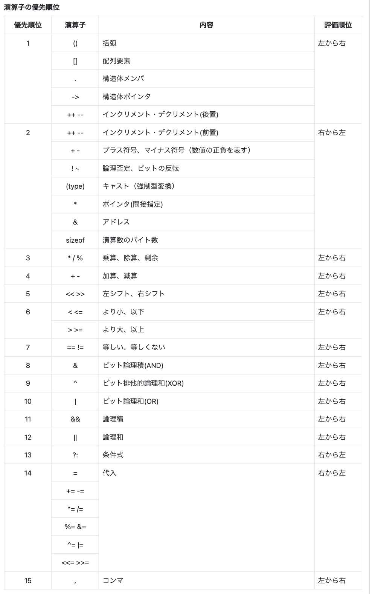
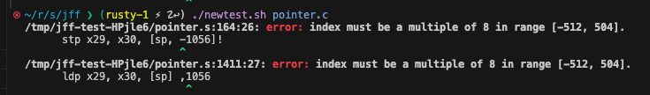

### 実装の注意
- まだ`int`が4bitではなく8bitで扱っている。変える際は、`type_utils.rs`の`new_int()`の`size`を8から4に変え、テストもそれ用に変えれば良いはず。
- `int add2(int x, int y)`の場合、x, yはローカル変数度等用の扱い。ただ`x`, `y`には`is_def_arg`が`true`に設定されているという点で、ブロック内で定義する変数と異なる。まだ未使用なパラメータだが、可変長引数の処理の際に使用する想定。
- ブロックは、`enter_scope`によって、variablesにベクタを追加し、`scope_idx`をインクリメントする。ブロックから抜ける際は`leave_scope`によってvariablesの最後尾(以前まで処理していたブロックスコープで管理していた変数が入っているベクタ)をpopして、`exited_scope_variables`に入れていく。最終的に`variables`は空になり、`exited_scope_variables`に変数がスコープを抜けた順に格納される。それを対象に`codegen.rs`で各変数のアドレス(offset)を決め, stack_sizeも計算している
- 関数は、`Ctx`の`functions`に、関数名をキーとした`Function`構造体をinsertすることで追加。追加の際に、`Ctx`の`processing_funcname`を更新する。`processing_funcname`は、parse中の`create_lvar`, `find_var`によって使用される。例えば`main`関数をパースしている間は、変数の追加や、変数の探索を、`Ctx.functions`から関数名で取得した`Function.variables`を参照して、そこに追加したり、探索するようにしている
- `.align`は3で決め打ちしている。2の方が適切なものもあるだろうが多めに取ってる
- `clone`多用しているけど何が何だかわからなくなってきた
- 符号拡張について、理解が曖昧のまま作ってるの、いつかバグを踏みそう
- 値デカすぎるとmovできない問題。movkとか使って、符号拡張とかしたりしちゃったり


## やること
- ドキュメントの整理
- コードの整理
- エラーメッセージの修正。Nodeにtokenの付与の検討
- for (int i = 0;)って感じで定義できるように。この場合のスコープってどうなってるんだ
- トークンを数個巻き戻ってエラーを出すことができる関数も必要かも
- 各種変数名の修正、冗長、不適切さの除去

## EBNF
- declspec = "int" | "char" | "struct"
- declaration = declspec ( declarator type_suffix ("=" expr)? ("," declarator ("=" expr)?)* )? ";"
- declarator = "*"* ident type_suffix
- type_suffix = "[" expr "]" | ε

- not_func_declaration =  declarator type_suffix ("," declarator typesuffix)* ";"
- func_declaration = declarator "(" (declspec declarator ("," declspec declarator)* )? ")"

### struct関連
- struct_decl =  ident? "{" struct-members

- program = (  declspec  ( no_func_declaration | func_declaration )  )*
- stmt = "return" expr ";" | expr-stmt | "{" compound-stmt | "if" "(" expr ")" stmt ("else" stmt)? | "for" "(" expr-stmt expr? ";" expr? ")" stmt | "while" "(" expr ")" stm        t
- compound-stmt = (declaration | stmt)* "}"
- expr-stmt = expr? ";"
- expr = assign
- assign = bit ( ("=" | "+=" | "-=" | "*=" | "/=" | "%=" | "&=" | "^=" | "|=") assign)?
- bit = equality ("|" equality | "^" equality | "&" equality)*
- equality = relational ("||" relational | "&&" relational | "==" relational | "!=" relational)*
- relational = add ("<" add | "<=" add | ">" add | ">=" add)*
- add = mul ("+" mul | "-" mul)*
- mul = unary ("*" unary | "/" unary)*
- unary = ("+" | "-" | "*" | "&") unary | postfix
- postfix = primary ("[" expr "]" | "." ident)?

- primary = num | "(" expr ")" | ident args? | "sizeof" unary
- args = "(" (declspec declrator ("," declspec declarator)*)? ")"

## 現在サポート中の演算子の優先順位
低
1. ,
2. =, +=, -=, *=, /=, %=, &=, ^=, |=
3. ==, !=, &&, ||
4. <, <=, >, >=
5. +, -
6. *, /, %
7. 単項+, 単項-, 単項*, 単項&
8. sizeof
9. []
10. ()

## 演算子の優先順位

source: https://c-lang.sevendays-study.com/appendix4.html

# メモ
- ポインタ同士の掛け算とかはどういう扱いになっているんだ今のコードだと。
  - できてしまう。

- multiletter variableを実装している時のFunctionの気持ちとしては、test.shで書いているシングルクォーテーションで囲まれた部分は、関数のブロック内で起こっていることみたいな感覚。int main() { ここ } の、ここの部分。
- 関数定義の引数はは、is_def_argをtrueにして、可変長引数の実装に使用する予定
- consumeとequalを使っているので分かれている。統一したい
- charのために、`strb`, `ldrsb`は使わなくて良いのか？
- グローバル変数を作るときは名前に_をつけるのが慣習らしいけど、なしでも動くから後でつけるときはつける。
  - 関数を呼び出すときは必要みたい。今は関数呼び出しはcodegenでアンダースコアをくっつけているだけ
- align, cstringなどはよくわからん。見よう見まねでつけている。
- グローバル変数の初期化も書かないとだなと考えている
- .zerofill __DATA,__common,_x,16,2, .zero, の違い
- .globalと.globlの違い。経緯
- RefCellわからず使っている
- ただのpanicで処理しているところ、tokenを持てるようにして、エラーを出そう
- index out of boundsでpanicでエラーにしているところも多々ある
- 今は入力文字列がファイル名でファイルが開ければファイルから値を取得。そうでなければ、入力文字列をコンパイルすることにしている
- ascii, ascizの違い。
- ポインタ +|- num はポインタ。ポインタ-ポインタは数値。


# 注意
```
                    let var = Var {
                        name: name.clone(),
                        offset: self.variables.len() as isize * 8, // 一旦今はlongだけのサポート。でもここは熟考する。usizeをisizeにしているから、大きすぎる値だとおかしくなりそう
                    };
```


## レジスタの汚れにより、テストが単体だと動くのに対して、バグることがある！ ->　ブロックスコープの実装がまだだからだった



- 今スコープ管理のidxがわかりにくい感じになっている


しかし、まだ以下のリンカ警告が表示されているようです：

csharp
コードをコピーする
ld: warning: c-string symbol 'lC1' ("OK\n") is located within another string, the entire string "({ char x = 1; char y = 2; x; })OK\n" will be used instead
この警告は、文字列シンボル lC1（"OK\n"）が別の文字列（"({ char x = 1; char y = 2; x; })OK\n"）の中に位置しており、リンカがそれらを一つの連続した文字列として扱っているために発生しています。

原因：

文字列リテラルがメモリ上で連続して配置され、適切な区切りやアライメントがないため、リンカがそれらを一つの文字列として認識しています。
解決策：

文字列間に明示的な終端文字を追加する：

.ascii は文字列をそのまま配置しますが、終端文字（ヌル文字）を付加しません。これにより、文字列が連結される可能性があります。代わりに .asciz を使用すると、自動的に終端文字が追加されます。

assembly
コードをコピーする
.text
.cstring
.align 3
lC0:
      .asciz "({ char x = 1; char y = 2; x; })"
.text
.cstring
.align 3
lC1:
      .asciz "OK\n"

```
Policy Summary

Data Types and Alignment: Align data based on its natural alignment requirements.

1-byte types (e.g., char): Alignment is generally not critical; no alignment needed.
4-byte types (e.g., int): Use .align 2 for 4-byte alignment.
8-byte types (e.g., pointers on 64-bit systems): Use .align 3 for 8-byte alignment.
Compiler Behavior: The compiler calculates the required alignment for each variable or constant and emits the corresponding .align directive to ensure that the data is aligned correctly in memory.
```

```
.ascii と .asciz の比較と決定要素

.ascizを使用する場合: アセンブラにnull終端を自動的に追加してほしいとき。
.asciiを使用する場合: null終端や特殊文字の位置を含む、文字列の内容を正確に制御する必要があるとき。
```

```
構造体のアラインメントは、中の要素が8以上の場合は8でアラインメントして、それより小さければ、その小ささって感じか
```